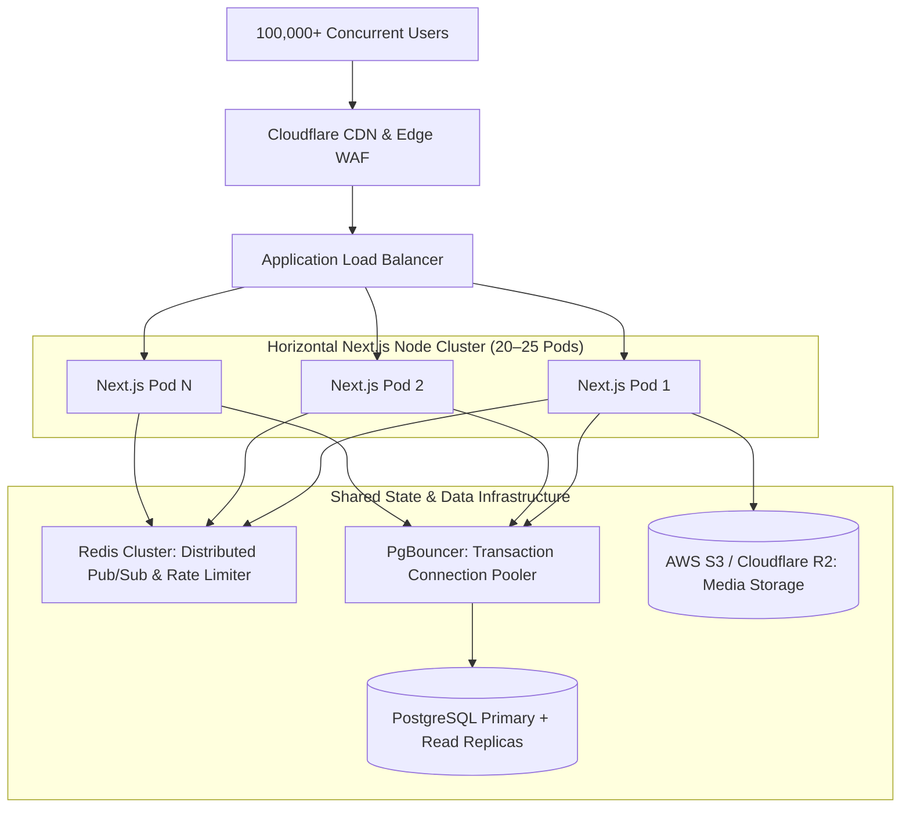

# Agri-Aqua Network — Production Operations & Incident Runbook

## 1. Architecture Overview
Agri-Aqua Network runs as a multi-instance containerized Next.js cluster behind an Application Load Balancer and Cloudflare Edge CDN/WAF.

---

## 2. Health Probes & Monitoring
- **Process Liveness Probe:** `GET /api/health/live` (Returns HTTP 200 with uptime while the V8 process is responsive).
- **Dependency Readiness Probe:** `GET /api/health/ready` (Probes PostgreSQL connection pool responsiveness with 2-second timeout guard; returns 503 on database unavailability).

---

## 3. Database Backup & Disaster Recovery
- **Backup Schedule:** Automated daily snapshots at 02:00 UTC with 30-day retention. Continuous Write-Ahead Logging (WAL) enabled for Point-in-Time Recovery (PITR).
- **Recovery Objectives:**
  - **RPO (Recovery Point Objective):** $< 15\text{ minutes}$ via WAL archiving.
  - **RTO (Recovery Time Objective):** $< 30\text{ minutes}$ for full cluster restoration.
- **Restore Drill Procedure:**
  1. Restore latest snapshot to isolated staging instance (`agri_aqua_staging_restore`).
  2. Verify schema and table row counts against primary.
  3. Execute smoke test suite against staging restored database.
  4. Never restore over active production databases.

---

## 4. Rollback & Zero-Downtime Deployment Runbook
- **Rolling Update Strategy:**
  1. Deploy new container image to standby instances.
  2. ALB performs health check probe against `/api/health/live` and `/api/health/ready`.
  3. Drain connections from previous instances gradually over 60 seconds (graceful SSE termination).
- **Rollback Trigger:**
  - If error rate exceeds $1.0\%$ or p95 latency exceeds $500\text{ms}$ within 5 minutes of release:
    1. Revert ALB target group routing to previous immutable container image tag.
    2. Roll back database migrations using documented down-migration scripts if applicable.

---

## 5. Incident Response Procedures

| Incident Type | Detection Signal | Immediate Mitigation Action |
| :--- | :--- | :--- |
| **Database Pool Exhaustion** | 503 responses on `/api/health/ready` | Verify PgBouncer connection pooler state; restart idle workers. |
| **High Memory / V8 Saturation** | Container restart warnings | Autoscale horizontal pods; inspect heap snapshots for socket leaks. |
| **DDoS / Traffic Spike** | Spike in request queue length | Enable Cloudflare "Under Attack Mode" and IP rate-limiting rules. |
| **Compromised User Session** | Unauthorized audit log entry | Execute Admin User Suspension or increment `tokenVersion` to immediately invalidate all active JWTs. |
