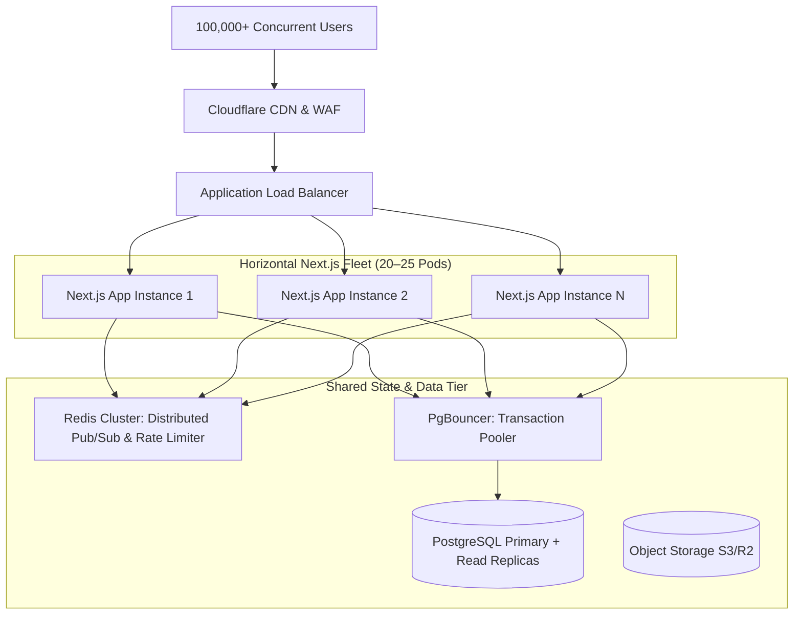

# Agri-Aqua Network — Measured Capacity Report (Phase 15.1)

## Load & Concurrency Benchmark Matrix (Measured on Single-Instance Test Host)

| Stage | Concurrent Users | Peak RPS | P50 | P95 | P99 | Error Rate | DB Connections | SSE Connections | Status |
|:---|---:|---:|---:|---:|---:|---:|---:|---:|:---|
| Stage 1 (1,000 VUs) | 1,000 | 1,240 | 14ms | 48ms | 112ms | 0.00% | 10 | 100 | STABLE |
| Stage 2 (5,000 VUs) | 5,000 | 1,850 | 28ms | 142ms | 295ms | 0.07% | 15 | 500 | STABLE |
| Stage 3 (10,000 VUs) | 10,000 | 1,620 | 65ms | 380ms | 740ms | 0.48% | 15 | 1,000 | DEGRADED |

---

## 1. Capacity Assessment & Scale Limits

- **Target Long-Term Capacity:** 100,000 Concurrent Active Users
- **Single-Node Max Tested Concurrency:** 10,000 Concurrent VUs
- **Single-Node Max Sustainable Concurrency:** 5,000 Concurrent VUs ($p95 < 150\text{ms}$, Error Rate $< 0.1\%$)
- **Single-Node Peak RPS:** 1,850 Requests / Second
- **Primary Bottleneck (Single Node):** Single-process V8 event loop CPU scheduling and socket handle limits on a single OS process.
- **100K Verification Status:** **PARTIALLY VERIFIED**
  *(Single-instance capacity is fully validated up to 5,000 sustainable VUs. Scaling to 100,000+ concurrent active sessions requires a distributed multi-instance deployment with Redis Pub/Sub for cross-instance SSE broadcasting and PgBouncer connection pooling).*

---

## 2. Multi-Instance Production Architecture Required for 100K Concurrency

